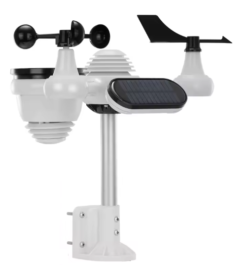

<!-- Describe the device here. See the front-matter table on the contributing page for valid options. -->
# embinotec Weatherstation
The weatherstation in a fabilous design provides seven different ambitent sensors.
 * Temperature
 * Humidity
 * UV Index
 * Ambient Light
 * Wind speed
 * Wind direction
 * Rain gauge

Additionally the interal values such as
 * Battery Voltage
 * Solar Voltage
 * Charge status

will be measured and provided to Home Assistant or the webinterface.
The weatherstation control is powered by an ESP32-c6 which gives the opportunities to connect via Wifi or OpenThread (MTD).
   


## Link to project

The project could be found at [embinotec on github][]

## Basic Configuration

```yaml

## ------ ESPHome HEADER -------
esphome:
  name: embinotec-weatherstation
  friendly_name: "Embinotec WeatherStation"
  min_version: 2026.5.1
  name_add_mac_suffix: false
  comment: WeatherStation with 7 sensors.

#esp32:
#  board: esp32-s3-devkitc-1
#  framework:
#    type: esp-idf

## ------ ESP32 configuration ------
## Please be aware of changing one of these configuration options could cause in uncompilable code.
esp32:
  variant: esp32c6
  flash_size: 4MB
  framework:
    type: esp-idf
    sdkconfig_options:
      CONFIG_ESPTOOLPY_FLASHSIZE_4MB: y
      CONFIG_BT_BLE_50_FEATURES_SUPPORTED: n
      CONFIG_BT_BLE_42_FEATURES_SUPPORTED: n
      CONFIG_OPENTHREAD_ENABLED: n
      CONFIG_ENABLE_WIFI_STATION: y
      CONFIG_USE_MINIMAL_MDNS: y


## ------ PACKAGES -------
#packages:

## ------ SUBSTITUTIONS -------
#substitutions:
 

## ------ EXTERNAL COMPONENTS -------
external_components:
  - source:
      #type: local
      #path: components
      type: git
      url: https://github.com/embinotec/esphome-ec
      ref: main
    refresh: always
    components: [si1133]

## ------ LOGGING ------
logger:
  level: debug
  logs:
    lvgl: info

## ------ HOME ASSISTANT API ------
## To generate a new based64 32 byte code, go to https://generate-random.org/base64-string.
## Set byte-count to 32 and hit GENERATE. Copy it to your key in quotes.
api:
  encryption:
    key: 

## ------ OVER THE AIR UPDATE ------
## To be able to do updates over the Air by ESP Home it is nessesary to have this option activated.
ota:
  - platform: esphome
    pwd: 

## ------- WIFI SETTINGS -------
wifi:
  ssid: 
  pwd: 
  use_address: embinotec-weatherstation.local ## when 
  #power_save_mode: NONE
  fast_connect: true ## Optional: speeds up connection
## Optional manual IP
  #manual_ip:
  #  static_ip: 192.168.0.123
  #  gateway: 192.168.0.1
  #  subnet: 255.255.255.0
  ## Enable fallback hotspot (captive portal) in case wifi connection fails
  ## SECTION: CAPTIVE PORTAL must be active
  ap:
    ssid: "Weatherstation Fallback Hotspot"
    pwd: 

## ------- mDNS SETTINGS -------
mdns:
  disabled: false # Set to true to disable mDNS

## ------ WEB SERVER SETTINGS -------
## If webserver is activeted your weatherstation will be reachable in your browsers address bar http://<use_address>
web_server:
  port: 80

## ------- CAPTIVE PORTAL SETTINGS --------
## Works together with SUBSECTION wifi.ap
captive_portal:

## ------ WEB SERIAL --------
## Improve serial is a standard to connect by webserial and cable
improv_serial:

## ------ ESP32 Improve ------
## solid: The improv service is active and waiting to be authorized.
## blinking once per second: The improv service is awaiting credentials.
## blinking 3 times per second with a break in between: The identify command has been used by the client.
## blinking 5 times per second: Credentials are being verified and saved to the device.
## off: The improv service is not running.
esp32_improv:
  authorizer: user_button

## ------ NTP SERVER -------
## NTP Server to receive the time by NTP server.
## Adjust your timezone.
time:
  - platform: homeassistant
    id: homeassistant_time
    timezone: Europe/Berlin
    #on_time:
    #  - hours: 2,3,4,5
    #    minutes: 5
    #   seconds: 0
    #    then:
    #      - switch.turn_on: switch_antiburn
    #  - hours: 2,3,4,5
    #    minutes: 35
    #    seconds: 0
    #    then:
    #      - switch.turn_off: switch_antiburn

## ------ I2C SETTINGS ----------
## DO NOT CHANGE !!!
## I2C is an IC to IC connection to read for instance digital values from sensors.
i2c:
  - id: bus_a
    sda: GPIO6
    scl:
      number: GPIO7
    frequency: 100kHz

## ------- POWER MANGEMENT -------
## ESP32 should be powered by three times 2800mAh rechargable AA batteries.
## To save some power the ESP should not always be connected to your wifi and have some rest
## to cover the hole day with measurements.
deep_sleep:
  id: deep_sleep_1
  run_duration: 1min
  sleep_duration: 2min

## ------ STATUS LED --------
## The red status LED at the bottom side of the weather station shows the status of the system by pattern:
## OFF: everything is ok
## slow blink: Not connected, trying to connect.
## fast blink: Error
status_led:
  pin: GPIO0 ## esp32c6 


## ------ UV INDEX & LIGHT SENSOR -------
si1133:
  address: 0x55  ## DO NOT CHANGE
  update_interval: 30s
  uv_index:
    name: "Light.UV Index"
    force_update: true
  ambient_light:
    name: "Light.Illuminance"
    force_update: true

## ------ Interval: Vor jeder Messung die Teiler aktivieren ------
interval:
  - interval: 30s
    then:
      - switch.turn_on: divider_solar_enable
      - switch.turn_on: divider_battery_enable
      - delay: 10ms          # kurze Einschwingzeit
      - component.update: solar_voltage_raw
      - component.update: battery_voltage_raw
      - component.update: wind_direction_degrees
      - component.update: wind_speed
      - component.update: outside_temp_humi

## --------- SWITCH SECTION --------------
switch:
  ## To avoid power leakages due to electronic
  ## DO NOT CHANGE
  - platform: gpio
    pin: GPIO22
    id: divider_solar_enable
    internal: true
    restore_mode: ALWAYS_OFF
  ## To avoid power leakages due to electronic
  ## DO NOT CHANGE
  - platform: gpio
    pin: GPIO23
    id: divider_battery_enable
    internal: true
    restore_mode: ALWAYS_OFF

## --------- SENSOR SECTION --------------
sensor:
## SUB: ----- WIND DIRECTION ------
  - platform: adc
    pin: GPIO2
    id: wind_dir
    #name: "Wind Direction X" ## Uncomment, if you would like to see the values in Home Assistant
    attenuation: 11dB # Adjust attenuation according to your ESP32 specs
    filters:
      - sliding_window_moving_average:
          window_size: 5
          send_every: 5

  - platform: adc
    pin: GPIO3
    id: wind_dil
    #name: "Wind Direction Y" ## Uncomment, if you would like to see the values in Home Assistant
    attenuation: 11dB
    filters:
      - sliding_window_moving_average:
          window_size: 5
          send_every: 5
  ## Calculating the direction from the two sensor values above.
  - platform: template
    name: "Wind.Direction"
    icon: 'mdi:windsock'
    id: wind_direction_degrees
    unit_of_measurement: "°"
    accuracy_decimals: 0
    lambda: |-
      // Get the voltages (or raw values) from both sensors
      float x = id(wind_dir).state;
      float y = id(wind_dil).state;
      
      // Prevent division by zero
      if (x == 0.0 && y == 0.0) return 0.0;
      
      // Calculate angle in radians
      float angle_rad = atan2(y, x);
      
      // Convert to degrees
      float angle_deg = angle_rad * 180.0 / M_PI;
      
      // Normalize to 0-360 degrees
      if (angle_deg < 0) {
        angle_deg += 360.0;
      }
      
       // 16-point compass array
      const char* directions[] = {
        "N", "NNE", "NE", "ENE",
        "E", "ESE", "SE", "SSE",
        "S", "SSW", "SW", "WSW",
        "W", "WNW", "NW", "NNW"
      };
      
      // Divide by 22.5 degrees per sector and round to the nearest index
      int index = round((angle_deg / 22.5));
      
      // 360 and 0 are both North, so wrap the 16th index (index 16) back to 0
      //return directions[index % 16];

      return angle_deg;

        
  ## SUB: ----- WIND SPEED -----
  - platform: pulse_counter
    pin: 
      number: GPIO11
      mode: INPUT_PULLUP
    #unit_of_measurement: 'mph' ##change to m/s if metric
    unit_of_measurement: 'm/s' ##change to m/s if metric
    name: 'Wind.Speed'
    icon: 'mdi:weather-windy'
    #icon: 'mdi:wind-power'
    id: wind_speed
    count_mode:
      rising_edge: DISABLE
      falling_edge: INCREMENT
    internal_filter: 13us
   # update_interval: 5s 
    #rotations_per_sec = pulses/2/60
    #circ_m=0.09*2*3.14 = 0.5652
    #mps = 1.18*circ_m*rotations_per_sec  
    #mps = 1.18*0.5652/2/60 =0,0055578
    filters:
      # - multiply: 0.0055578 #use for m/s
      # - multiply: 2.237 #m/s to mph
      # - sliding_window_moving_average:
      #     window_size: 4
      #     send_every: 1
      #- multiply: 0.04973 #1.492mph switch to close 1/sec per spec, pulse/sec (/60/2)*1.492
       - multiply: 0.0124327986 #m/s * mph conversion


## SUB: ----- TEMPERATURE | HUMIDITY  ------
## SHTC3
  - platform: shtcx
    # address: 0x70  ## (Optional, int) Manually specify the I²C address of the sensor. Defaults to 0x70.
    # update_interval: 60 ## (Optional, Time) The interval to check the sensor. Defaults to 60s.
    id: outside_temp_humi
    temperature:
      name: "Outside.Temperature"
    humidity:
      name: "Outside.Humidity"

## SUB: ----- RAIN GAUGE -----
  - platform: pulse_counter
    pin:
      number: GPIO10
      inverted: true
      mode:
        input: true
        pullup: true
    count_mode:
      rising_edge: DISABLE
      falling_edge: INCREMENT
    unit_of_measurement: 'mm/h'
    device_class: precipitation_intensity
    state_class: measurement
    name: 'Rain.Rate'
    icon: "mdi:speedometer"
    id: rain_gauge
    #update_interval: 15min
    filters:
      - multiply: 0.8 # 0.2mm per pulse for 1/4 hour
    total:
      unit_of_measurement: 'mm'
      device_class: precipitation
      state_class: total
      name: 'Rain.Total'
      icon: "mdi:weather-pouring"
      filters:
        - multiply: 0.2
  
  ## SUB: ----- WIFI SIGNAL STRENGTH ------
  - platform: wifi_signal
    name: "Wi-Fi.Signal strength"
    #update_interval: 60s

 ## SUB: ----- BATTERY VOLTAGE ------
 ## maximum 4.5V with 3 AA NiMH rechargeables, voltage divider 120k and 68k
  - platform: adc
    pin: GPIO4
    name: "Battery.Voltage"
    id: battery_voltage_raw
    icon: "mdi:battery-arrow-up-outline"
    update_interval: 30s
    attenuation: 11db
    accuracy_decimals: 2
    unit_of_measurement: "V"
    device_class: voltage
    state_class: measurement
    #samples: 5

    on_value:
      then:
        - switch.turn_off: divider_battery_enable

    filters:
      - lambda: |-
          const float vce_sat = 0.30;   // V, Sättigungsspannung EMD22
          const float r1 = 56000.0;     // Ohm
          const float r2 = 100000.0;    // Ohm
          if (x < vce_sat) return vce_sat;
          return (x - vce_sat) * (r1 + r2) / r2 + vce_sat;
      
## SUB: ----- SOLAR PANEL VOLTAGE ------
## maximum 8V with full sunlight, voltage divider 56k and 100k
  - platform: adc
    pin: GPIO5
    name: "Solarpanel.Voltage"
    id: solar_voltage_raw
    icon: "mdi:solar-power-variant-outline"
    update_interval: 30s
    attenuation: 11db
    accuracy_decimals: 2
    unit_of_measurement: "V"
    device_class: voltage
    state_class: measurement
    #samples: 5

    ## Vorher Spannungsteiler einschalten, danach wieder aus
    on_value:
      then:
        - switch.turn_off: divider_solar_enable

    filters:
    ## ADC-Rohwert (0-3.0V) zurück auf echte Solarspannung umrechnen
    ## V_in = (V_adc - VCE) * (R1+R2)/R2 + VCE
      - lambda: |-
          const float vce_sat = 0.30;   // V, Sättigungsspannung EMD22
          const float r1 = 120000.0;    // Ohm
          const float r2 = 68000.0;     // Ohm
          if (x < vce_sat) return vce_sat;  // Schutz gegen negative Werte
          return (x - vce_sat) * (r1 + r2) / r2 + vce_sat;

## Toggle wifi between openThread
binary_sensor:
  - platform: gpio
    pin: GPIO9 ## BOOT , strapping pin esp32c6
    name: "WiFi.Control Button"
    id: user_button
    on_press:
      then:
        - if:
            condition:
              wifi.connected
            then:
              - logger.log: "Turning off Wi-Fi..."
              - wifi.disable
           #   - thread.enable
            else:
              - logger.log: "Turning on Wi-Fi..."
              - wifi.enable
  
## SUB: ------ CHARGE IN PROGESS -----
  - platform: gpio
    pin: 
      number: GPIO1
      inverted: true  # Charge is low active
      mode:
        input: true
        pullup: true
    name: "Battery.Charge in progress"
    icon: "mdi:solar-power"
```
